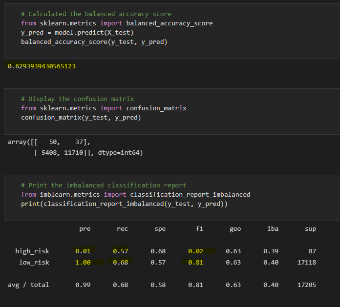

# Credit_Risk_Analysis

Analyze credit card risk with machine learning

## Overview

Use python to evaluate several machine learning models to predict credit risk and determine the accuracy of the models. 
Models to use and evaluate:
- oversampling with RandomOverSampler and SMOTE
- undersampling with ClusterCentroids
- oversample and undersample using SMOTEENN
- compare two machine learning models that reduce bias BalancedRandomForestClassifier and EasyEnsembleClassifier

## Analysis

### RandomOverSampler

- Balanced Accuracy Score: 62.9%
- Precision for high risk: 1%
- Precision for low risk: 100%
- Recall for high risk: 57%
- Recall for low risk: 68%

### SMOTE

- Balanced Accuracy Score: 62.8%
- Precision for high risk: 1%
- Precision for low risk: 100%
- Recall for high risk: 62%
- Recall for low risk: 63%

### ClusterCentroids

- Balanced Accuracy Score: 51.6%
- Precision for high risk: 1%
- Precision for low risk: 100%
- Recall for high risk: 60%
- Recall for low risk: 43%

### SMOTEENN

- Balanced Accuracy Score: 64.1%
- Precision for high risk: 1%
- Precision for low risk: 100%
- Recall for high risk: 70%
- Recall for low risk: 58%

### BalancedRandomForestClassifier

- Balanced Accuracy Score: 78.7%
- Precision for high risk: 3%
- Precision for low risk: 100%
- Recall for high risk: 68%
- Recall for low risk: 90%

### EasyEnsembleClassifier

- Balanced Accuracy Score: 92.5%
- Precision for high risk: 7%
- Precision for low risk: 100%
- Recall for high risk: 91%
- Recall for low risk: 94%

## Summary

Every model returns very low precision in predicting a high credit risk. For the first four models it is evident that the resampling attempted to address the imbalance in classes of high risk and low risk, however could not guarantee better results. The models remain weak in determining high credit risk with low precision, recall, and accuracy. However, the Ensemble models brought significant improvement particularly for the sensitivity for high risk. The EasyEnsembleClassifier model provided a high accuracy of 92.5% as well as high sensitivity for high and low risk credits (91% and 94% respectively).
